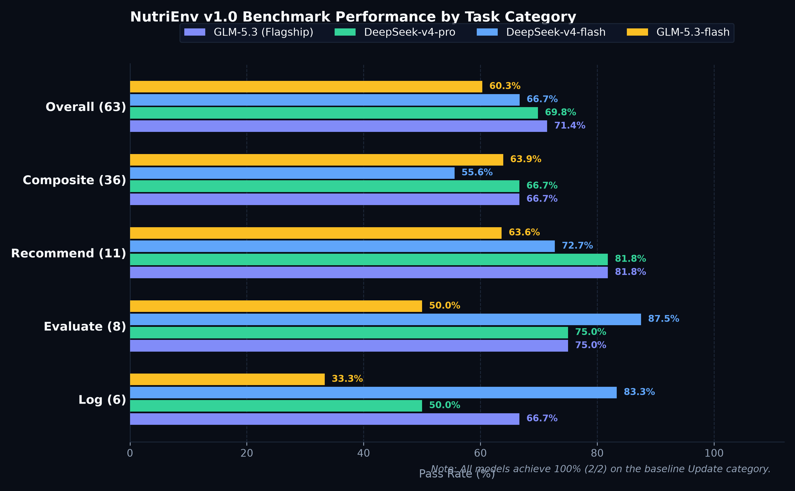
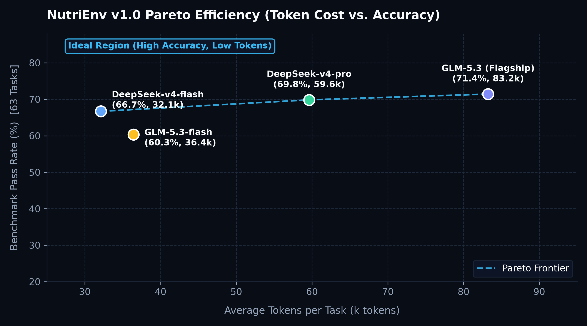

# NutriEnv: An Interactive Nutrition Benchmark & Environment for LLM Agents

<p align="center">
  <a href="https://www.python.org/"></a>
  <a href="LICENSE"></a>
  <a href="https://github.com/SnackJJ/NutriEnv"></a>
  <a href="tests/"></a>
  <a href="https://snackjj.github.io/"></a>
</p>

NutriEnv is an interactive, steppable environment and benchmark suite designed to evaluate the multi-turn tool interaction, dietary state tracking, high-dimensional inequality planning, and nutrition grounding capabilities of Large Language Models (LLMs) and Agentic AI.

Unlike traditional static QA datasets, NutriEnv evaluates agents in a stateful, interactive environment grounded in the USDA Food and Nutrient Database for Dietary Studies (FNDDS).

---

## Evaluation Leaderboard (NutriEnv v1.0)

The official NutriEnv v1.0 benchmark consists of 63 curated tasks with audited construct validity.

<p align="center">
  
</p>

<p align="center">
  
</p>

### Main Results

| Rank | Model | Total Pass Rate | Solved / Total | Avg Turns | Avg Latency | Update (2) | Log (6) | Evaluate (8) | Recommend (11) | Composite (36) |
|:---:|:---|:---:|:---:|:---:|:---:|:---:|:---:|:---:|:---:|:---:|
| 1 | **GLM-5.3 (Flagship)** | **71.4%** | **45 / 63** | 14.7 | 114.3s | 2/2 (100%) | 4/6 (66.7%) | 6/8 (75.0%) | 9/11 (81.8%) | **24/36 (66.7%)** |
| 2 | **DeepSeek-v4-pro** | **69.8%** | **44 / 63** | 12.6 | 168.5s | 2/2 (100%) | 3/6 (50.0%) | 6/8 (75.0%) | 9/11 (81.8%) | **24/36 (66.7%)** |
| 3 | **DeepSeek-v4-flash** | **66.7%** | **42 / 63** | 10.9 | 251.1s | 2/2 (100%) | **5/6 (83.3%)** | **7/8 (87.5%)** | 8/11 (72.7%) | 20/36 (55.6%) |
| 4 | **GLM-5.3-flash** | **60.3%** | **38 / 63** | **10.9** | **60.2s** | 2/2 (100%) | 2/6 (33.3%) | 4/8 (50.0%) | 7/11 (63.6%) | 23/36 (63.9%) |

> Evaluated on standardized API endpoints across reasoning and lightweight models. Full execution traces, logs, and token metrics are preserved in [`reports/`](./reports/).

---

## Environment Architecture & Tool Protocol

NutriEnv models an interactive dialogue between a user and an AI dietary assistant. The world state mutates deterministically based on agent actions:

```
                  +-----------------------------------------+
                  |          NutriEnv WorldState            |
                  |  |- User Profile (allergies, DRI bands) |
                  |  |- Meal Ledger  (history & timestamps) |
                  |  +- Food Catalog (USDA FNDDS SQLite)    |
                  +--------------------+--------------------+
                                       |
                Actions (JSON)         | Observations (Dict)
                      |                |
                      v                v
             +-----------------------------------+
             |       LLM Agent (ReAct Loop)      |
             +-----------------------------------+
```

### Action Space

| Action | Parameters | Description |
|:---|:---|:---|
| `search_foods` | `q: str` | BM25 full-text search against the USDA FNDDS catalog |
| `get_food` | `food_id: str` | Inspect food portions, measures, calories, and micronutrients |
| `log_meal` | `food_id, grams, eaten_at` | Record an intake item to the user's meal ledger |
| `amend_meal`| `index, grams?, food_id?` | Modify or substitute an existing ledger entry |
| `update_profile` | `patch: dict` | Update dietary targets, DRI windows, or allergies |
| `submit_plan`| `items: list[dict]` | Propose a planned meal satisfying target nutrition windows |
| `evaluate_diet`| `verdict, reasons` | Accept/reject candidate foods based on clinical guidelines & myths |
| `finish` | `message: str` | Finalize task turn |

---

## Evaluation Philosophy: Ground-Truth Oracle Matching

NutriEnv abides by an objective axiomatic evaluation rule:
$$\text{Pass} \iff \text{End State} == \text{Oracle}$$

1. **Deterministic Verification over LLM-as-a-Judge**: Scoring inspects deterministic environment state mutations rather than subjective LLM judges:
   - Profile equality (allergies, health targets).
   - Ledger set equality with $\pm 15\%$ physical measure tolerance.
   - Exact mathematical satisfaction of multi-dimensional nutrient windows:
     $$\text{Nutrient}_k = \sum \text{grams}_i \times \frac{\text{Nutrient}_{i,k}}{100} \in [\text{Lower}_k, \text{Upper}_k]$$
2. **Zero Cheat-Sheets**: Handbooks provide tool specs and action schemas. Agents must reason and ground colloquial portions autonomously via `search_foods` + `get_food`.
3. **Safety Redlines**: Proposing or logging foods containing user allergens triggers an immediate `allergy_violation` failure.

---

## Quick Start

### 1. Installation

```bash
git clone https://github.com/SnackJJ/NutriEnv.git
cd NutriEnv

python3 -m venv .venv
source .venv/bin/activate
pip install -e ".[dev]"
```

### 2. Configure API Keys

```bash
cp .env.example .env.local
# Add your ARK_API_KEY / DASHSCOPE_API_KEY / DEEPSEEK_API_KEY
```

### 3. Run Unit & Regression Tests

```bash
pytest
# 1,408 passed
```

### 4. Run Benchmark Suite

```bash
# Evaluate GLM-5.3 on the official v1.0 benchmark (63 tasks)
python scripts/eval_benchmark_suite.py \
  --split data/splits/nutrienv-v1.0.json \
  --model ark/glm-5.3 \
  --workers 5 \
  --out reports/benchmark_ark_glm-5.3_v1.0.json
```

---

## Repository Structure

NutriEnv maintains a clean, industry-standard layout:

```text
nutri-env/
|-- src/nutrienv/              # Core environment package
|   |-- env/                   # Interactive Gym-style step/reset loop
|   |-- world/                 # Food catalog (SQLite), Profile, Ledger state
|   |-- actions/               # Action schemas, validators, and execution dispatch
|   |-- bench/                 # Task generator, Oracle solver, Scorer
|   |-- harness/               # Agent harnesses (ReAct, Script, Telemetry)
|   +-- io/                    # Network clients & environment loaders
|-- data/
|   |-- fdc/                   # USDA FDC SQLite database snapshot
|   +-- splits/
|       |-- nutrienv-v1.0.json # Official v1.0 benchmark split (63 curated tasks)
|       +-- nutrienv-mini.json # Fast smoke evaluation split (10 tasks)
|-- reports/                   # Official benchmark results & charts
|   |-- assets/                # Visual charts (PNG assets)
|   +-- benchmark_*_v1.0.json  # Raw evaluation trajectories & metric dumps
|-- docs/                      # Architectural Decision Records (ADRs) & specs
|-- scripts/                   # Evaluation runner and visualization tools
+-- tests/                     # 1,408 test cases covering 100% of environment logic
```

---

## Citation & License

This project is licensed under the [MIT License](LICENSE).

```bibtex
@misc{snackjj2026nutrienv,
  author = {Jiaqi Zhang},
  title = {NutriEnv: An Interactive Nutrition Benchmark & Environment for LLM Agents},
  year = {2026},
  publisher = {GitHub},
  howpublished = {\url{https://github.com/SnackJJ/NutriEnv}}
}
```
