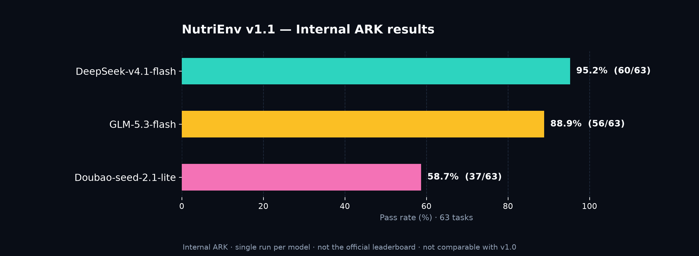
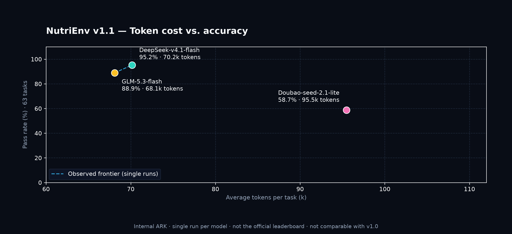
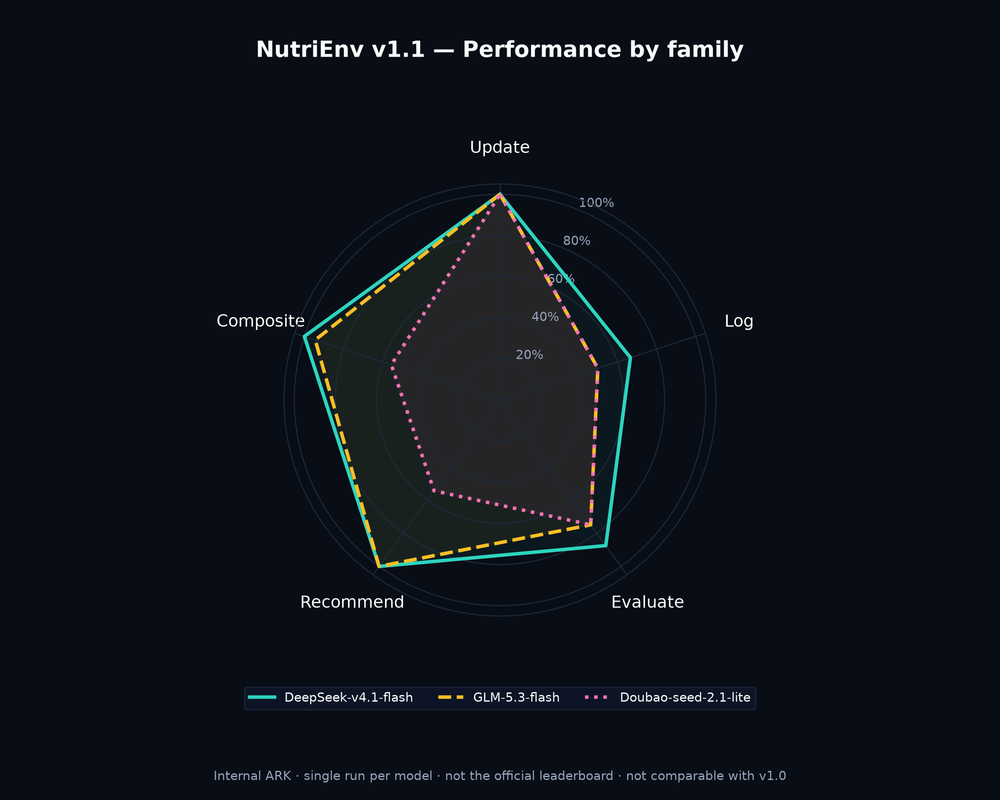

# NutriEnv v1.1: An Interactive Nutrition Benchmark for LLM Agents

<p align="center">
  <a href="https://www.python.org/"></a>
  <a href="LICENSE"></a>
  <a href="data/splits/nutrienv-v1.1.json"></a>
</p>

NutriEnv evaluates multi-turn tool use, dietary state tracking, portion grounding and nutrient
planning in a deterministic, stateful environment grounded in USDA FNDDS catalog facts.
An agent searches foods, inspects portions, edits a profile or meal ledger and submits a plan;
a deterministic scorer checks the resulting state against the task contract, not an LLM judge.

## v1.1 results

**Internal ARK, single run per model, not the official leaderboard.** These three complete
63-task runs use the Volcano Engine ARK Agent Plan endpoint, serial native function calling,
temperature 0 and full context. No voids are included. A single run does not establish a stable
model ranking; endpoint latency and token accounting are provider-specific.

| Model (ARK) | Pass | Rate | Avg steps | Avg latency | Update (2) | Log (6) | Evaluate (8) | Recommend (11) | Composite (36) |
|:--|--:|--:|--:|--:|--:|--:|--:|--:|--:|
| [DeepSeek-v4.1-flash](reports/ab_ark_deepseek-v4.1-flash_v1.1-new_fc.json) | 60/63 | 95.24% | 11.84 | 60.81s | 2/2 | 4/6 | 7/8 | 11/11 | 36/36 |
| [GLM-5.3-flash](reports/ab_ark_glm-5.3-flash_v1.1-new_fc.json) | 56/63 | 88.89% | 11.29 | 171.55s | 2/2 | 3/6 | 6/8 | 11/11 | 34/36 |
| [Doubao-seed-2.1-lite](reports/ab_ark_doubao-seed-2.1-lite_v1.1-new_fc.json) | 37/63 | 58.73% | 11.79 | 465.32s | 2/2 | 3/6 | 6/8 | 6/11 | 20/36 |

<p align="center">
  
  
  
</p>

> **New ruler, not a v1.0 improvement claim.** The split is
> `nutrienv-v1.1-mass-envelopes-20261005`, scorer `s10-meal-mass-envelope`, prompt
> `p8-published-meal-mass-limits`, loop `l2-refused-handin-continues`.
> Questions, gold portions, nutrient windows, inventory interpretations, catalog and scoring
> differ from v1.0 and earlier v1.1 generations. Their pass rates are **not directly comparable**.
> All 189 task queries and recorded action acceptance/pass tags replay unchanged against the
> published artifacts. [`reports/v1.1-provenance.json`](reports/v1.1-provenance.json) binds those
> artifacts by SHA-256; these are current replay-verified hashes, not hashes recorded at run time.

Regenerate the charts and table from the reports, with replay verification:

```sh
uv run --extra plots python scripts/render_v1_1.py
```

## Current contract

The [v1.1 contract](docs/review-v1.1-query-contracts.md) defines scoring and its limitations.

- **Portions:** explicit household units use that food's own portion key and count. A named
  food without a unit uses QNS; missing or unsupported units require clarification, not guessed grams.
- **Daily targets:** Mifflin–St Jeor EER and goal-specific windows. Maintenance/cut use adult
  AMDR macro ranges; muscle uses a benchmark protein target of 1.6–2.2 g/kg/day. Cut subtracts
  300 kcal. Sodium stays at most 2300 mg; only the fiber ceiling retains 15% reference slack.
- **Planning:** main-meal mass at most 1500 g, snack 500 g, whole day 4000 g, including drinks.
  Scope is immutable episode context, visible in reset/get_profile. Logging eaten foods remains descriptive.
- **Explicit high protein:** a requested high-protein plan needs at least 10 g protein and
  20% of catalog energy from protein. A muscle persona alone does not impose this meal rule.
- **Profile edits:** invalid facts or incompatible target ranges fail atomically. Body-fact
  edits re-derive windows; explicit window overrides preserve other keys. Combining both modes is rejected.
- **Interpretations:** complete reviewed ledger variants are matched as whole ledgers; remaining
  budgets use the matched gold ledger, not tolerance-undercounted submitted grams.
- **Authoring:** [agent-authored admission](docs/agent-authored-tasks.md) requires structured catalog
  evidence, legal witnesses and separate exact-hash semantic review. Parser/template generation is explicitly legacy.

Pass is binary: required profile/ledger/plan conditions must hold in the final state. Ledger
amounts allow ±15% tolerance; identity and other task conditions still apply. Food allergy
violations fail scoring. Action errors return explicit observations rather than mutate invalid state.

### Action space

| Action | Purpose |
|:--|:--|
| `search_foods`, `get_food` | Search the FNDDS catalog and inspect food/portion/nutrient facts |
| `get_profile`, `get_ledger` | Read episode context and consumed meals |
| `update_profile` | Change profile facts or explicit nutrient targets |
| `log_meal`, `amend_meal` | Record or correct consumed food |
| `submit_plan` | Hand in an accepted or rejected candidate with structured reasons |
| `update_plan` | Inspect the existing plan's totals and fit without mutating it |
| `finish` | End a non-plan task |

### Limitations

Search uses exact-token AND matching with FTS5 BM25 ranking, without stemming; rephrasing may
be needed for singular/plural names. Broader search recall and prompt wording changes are deferred
to another protocol version. Reviewed interpretations are finite, edamame soy-tag repair is not a
complete allergen audit, and ordinary caps do not prove qualitative claims such as “light” or
“sugar-conscious”. Some safety tasks judge only state, not verbal advice. Mass envelopes are
conservative adult benchmark limits, not medical or physiological maxima. See the contract for
known task-specific gaps and historical replay incompatibilities.

## Quick start

```sh
git clone https://github.com/SnackJJ/NutriEnv.git
cd NutriEnv
uv sync --extra dev
cp .env.example .env.local
# Set the API key for your chosen provider; do not commit .env.local.

uv run pytest -q tests/test_profile_and_plan_mass.py tests/test_goal_nutrition_contract.py tests/test_split_v1_1.py
uv run python scripts/build_split_v1_1.py --check
uv run python scripts/check_achievable.py --split data/splits/nutrienv-v1.1.json

# Explicit provider route; running this spends API quota.
uv run python scripts/eval_benchmark_suite.py \
  --split data/splits/nutrienv-v1.1.json \
  --model commandcode/inclusionai/ling-3.0-flash-sante:free \
  --workers 5 --out reports/my_v1.1_run.json
```

The exam binds `data/fdc/catalog-v3.sqlite`. Required catalogs/configuration must exist;
missing inputs fail loudly. The reductions in [`data/splits/`](data/splits/README.md) are smoke
or paired-harness instruments, not substitutes for the 63-task result.

## Repository layout

- `src/nutrienv/`: world, actions, steppable environment, scorer, authoring pipeline and harnesses.
- `data/fdc/`: active v3 and historical catalog fixtures; raw USDA downloads are ignored.
- `data/splits/`: current exam, three reductions, reviewed content manifest and historical fixtures.
- `reports/`: cited result traces, provenance and charts; local probes are archived separately.
- [`docs/`](docs/README.md): current contracts and historical decisions.
- [`scripts/`](scripts/README.md): evaluation, verification, catalog build and visualization.
- `tests/`: current and compatibility regressions; `archive/` is excluded from default collection.

## v1.0 (historical)

The following published table and chart assets retain the v1.0 results. **They are not measured
under the current v1.1 ruler.** Reproduce the original protocol from revision `94c211a` rather
than replay v1.0 through today's scorer and call the result comparable.

<p align="center">
  
  
</p>

| Rank | Model | Mean Pass Rate | Mean Solved / 63 | Runs | Avg Steps | Avg Latency | Update (2) | Log (6) | Evaluate (8) | Recommend (11) | Composite (36) | text-json (1 run) |
|:---:|:---|:---:|:---:|:---:|:---:|:---:|:---:|:---:|:---:|:---:|:---:|:---:|
| 1 | **DeepSeek-v4.1-flash (official API: `deepseek-flash`)** | **84.1%** | **53.0** | 53 (1 run) | 11.6 | 40.1s | 100.0% | 83.3% | 87.5% | 81.8% | 83.3% | Not run |
| 1 | **MiMo-v2.6-flash** | **84.1%** | **53.0** | 51 / 55 | 13.9 | 329.6s | 100.0% | 75.0% | 87.5% | 81.8% | 84.7% | 43 / 63 |
| 2 | **DeepSeek-v4-pro** | **81.7%** | **51.5** | 53 / 50 | 10.8 | 100.6s | 100.0% | 66.7% | 75.0% | 81.8% | 84.7% | 54 / 63 |
| 3 | **GLM-5.3-flash** | **81.0%** | **51.0** | 51 | 12.2 | 235.4s | 100.0% | 66.7% | 75.0% | 81.8% | 83.3% | 53 / 63 |
| 4 | **DeepSeek-v4-flash** | **74.6%** | **47.0** | 43 / 51 / 47 | 11.8 | 36.8s | 100.0% | 72.2% | 66.7% | 84.8% | 72.2% | 44 / 63 |
| 5 | **DeepSeek-v4.1-flash** | **68.3%** | **43.0** | 37 / 49 / 43 | 11.7 | 42.6s | 100.0% | 77.8% | 70.8% | 75.8% | 62.0% | 44 / 63 |

The official API row is one complete run through `https://api.deepseek.com/v1/chat/completions`,
using API model ID `deepseek-flash`; other rows use Command Code. The table reports means over
complete runs, family columns pool those runs, and *Runs* lists solved counts. Partial HTTP 429
runs were excluded. At temperature 0 DeepSeek-v4.1-flash varied by 12 tasks (37 / 49 / 43);
run counts differ, and nearby means do not establish distinct capability ranks.

Protocol: `nutrienv-v1.0.json`, scorer `s6-free-recommend-windows`, prompt
`p5-fc-manual-lines`, loop `l2-refused-handin-continues`, full context, serial native function
calling, temperature 0. The text-json column is one run re-judged offline with that same scorer.
[Official API report](reports/benchmark_deepseek_deepseek-flash_v1.0_fc_r1.json);
Command Code traces remain in `reports/benchmark_commandcode_<model>_v1.0_fc_r<k>.json` and `…_text.json`.
The earlier four-model ARK table predates this protocol and is kept in git history, not compared here.

### Earlier DeepSeek official API result

| Model | Pass Rate | Solved / Total | Avg Steps | Avg Latency | Update (2) | Log (6) | Evaluate (8) | Recommend (11) | Composite (36) |
|:---|:---:|:---:|:---:|:---:|:---:|:---:|:---:|:---:|:---:|:---:|
| DeepSeek-v4.1-flash | 84.13% | 53 / 63 | 12.37 | 33.52s | 2/2 (100.0%) | 6/6 (100.0%) | 7/8 (87.5%) | 8/11 (72.7%) | 30/36 (83.3%) |

[Historical report](reports/benchmark_deepseek_deepseek-v4.1-flash_v1.0_toolcall_noparallel.json),
API model `deepseek-v4.1-flash-expires-on-0910`, serial function calling with parallel calls disabled.
It predates recorded prompt/scorer/loop identity and is not directly comparable with either table.

## Citation & license

[MIT License](LICENSE).

```bibtex
@misc{snackjj2026nutrienv,
  author = {Zeqing Jiang},
  title = {NutriEnv: An Interactive Nutrition Benchmark & Environment for LLM Agents},
  year = {2026},
  publisher = {GitHub},
  howpublished = {\url{https://github.com/SnackJJ/NutriEnv}}
}
```
