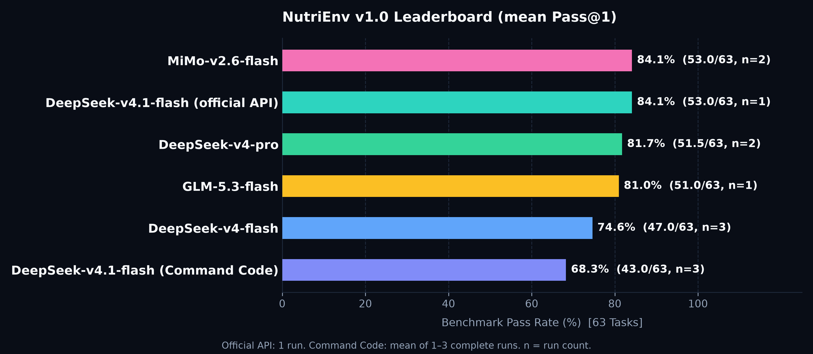
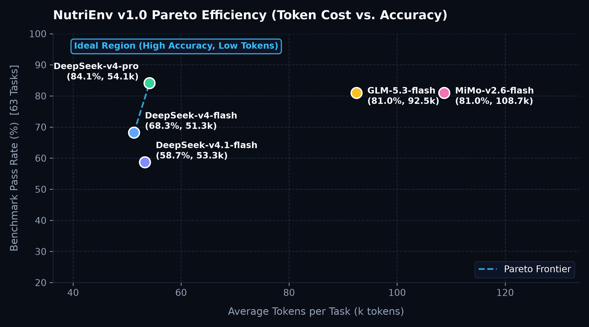

# NutriEnv: An Interactive Nutrition Benchmark & Environment for LLM Agents

<p align="center">
  <a href="https://www.python.org/"></a>
  <a href="LICENSE"></a>
  <a href="https://github.com/SnackJJ/NutriEnv"></a>
</p>

NutriEnv is an interactive, steppable environment and benchmark suite designed to evaluate the multi-turn tool interaction, dietary state tracking, high-dimensional inequality planning, and nutrition grounding capabilities of Large Language Models (LLMs) and Agentic AI.

Unlike traditional static QA datasets, NutriEnv evaluates agents in a stateful, interactive environment grounded in the USDA Food and Nutrient Database for Dietary Studies (FNDDS).

---

## Evaluation Leaderboard (NutriEnv v1.0)

The official NutriEnv v1.0 benchmark consists of 63 curated tasks with audited construct validity.

<p align="center">
  
</p>

<p align="center">
  
</p>

### Main Results

| Rank | Model | Mean Pass Rate | Mean Solved / 63 | Runs | Avg Steps | Avg Latency | Update (2) | Log (6) | Evaluate (8) | Recommend (11) | Composite (36) | text-json (1 run) |
|:---:|:---|:---:|:---:|:---:|:---:|:---:|:---:|:---:|:---:|:---:|:---:|:---:|
| 1 | **MiMo-v2.6-flash** | **84.1%** | **53.0** | 51 / 55 | 13.9 | 329.6s | 100.0% | 75.0% | 87.5% | 81.8% | 84.7% | 43 / 63 |
| 2 | **DeepSeek-v4-pro** | **81.7%** | **51.5** | 53 / 50 | 10.8 | 100.6s | 100.0% | 66.7% | 75.0% | 81.8% | 84.7% | 54 / 63 |
| 3 | **GLM-5.3-flash** | **81.0%** | **51.0** | 51 | 12.2 | 235.4s | 100.0% | 66.7% | 75.0% | 81.8% | 83.3% | 53 / 63 |
| 4 | **DeepSeek-v4-flash** | **74.6%** | **47.0** | 43 / 51 / 47 | 11.8 | 36.8s | 100.0% | 72.2% | 66.7% | 84.8% | 72.2% | 44 / 63 |
| 5 | **DeepSeek-v4.1-flash** | **68.3%** | **43.0** | 37 / 49 / 43 | 11.7 | 42.6s | 100.0% | 77.8% | 70.8% | 75.8% | 62.0% | 44 / 63 |

> **Protocol.** `data/splits/nutrienv-v1.0.json` (63 tasks), native function calling
> (`--contract native-tools`, the default), temperature 0, all models through the Command Code
> provider plan. The table reports the **mean over complete runs** (listed under *Runs*; family
> columns pool those runs). Every report records the ruler it was measured with:
> `scorer_version = s6-free-recommend-windows`, `loop_version = l2-refused-handin-continues`,
> `prompt_version = p5-fc-manual-lines`. The **text-json** column is one run of the same model on
> the ReAct text contract, re-judged offline with the same Scorer (`scripts/rescore_report.py`).
> Full traces and token counts are in [`reports/`](./reports/)
> (`benchmark_commandcode_<model>_v1.0_fc_r<k>.json`, `…_text.json`); per-run Pass / Rate rows can
> be regenerated with `scripts/render_leaderboard.py`.
>
> **Runs are noisy, and the run counts differ.** At temperature 0 the same model and code moved
> by up to 12 tasks between runs (DeepSeek-v4.1-flash: 37 / 49 / 43), so the top three rows are
> within run-to-run noise of each other. Three runs were planned for every model; a further run of
> DeepSeek-v4-pro, MiMo-v2.6-flash and two of GLM-5.3-flash hit the provider's usage limit
> (HTTP 429) part-way, so those partial runs are excluded rather than averaged in.
>
> **Not comparable with the previous table.** The earlier leaderboard (GLM-5.3 flagship,
> DeepSeek-v4-pro/flash and GLM-5.3-flash via the Volcano Engine ARK plan, since retired) was
> measured before the scorer and episode-loop revisions listed in [CHANGELOG](./CHANGELOG.md);
> it is kept in git history only. GLM-5.3 (flagship) was not re-measured.

---

## Environment Architecture & Tool Protocol

NutriEnv models an interactive dialogue between a user and an AI dietary assistant. The world state mutates deterministically based on agent actions:

```
                  +-----------------------------------------+
                  |          NutriEnv WorldState            |
                  |  |- User Profile (allergies, DRI bands) |
                  |  |- Meal Ledger  (history & timestamps) |
                  |  +- Food Catalog (USDA FNDDS SQLite)    |
                  +--------------------+--------------------+
                                       |
                Actions (JSON)         | Observations (Dict)
                      |                |
                      v                v
             +-----------------------------------+
             |       LLM Agent (ReAct Loop)      |
             +-----------------------------------+
```

### Action Space

| Action | Parameters | Description |
|:---|:---|:---|
| `search_foods` | `q: str` | BM25 full-text search against the USDA FNDDS catalog |
| `get_food` | `food_id: str` | Inspect food portions, measures, calories, and micronutrients |
| `log_meal` | `food_id, grams, eaten_at` | Record an intake item to the user's meal ledger |
| `amend_meal`| `index, grams?, food_id?` | Modify or substitute an existing ledger entry |
| `update_profile` | `patch: dict` | Update dietary targets, DRI windows, or allergies |
| `submit_plan`| `items: list[dict]` | Propose a planned meal satisfying target nutrition windows |
| `evaluate_diet`| `verdict, reasons` | Accept/reject candidate foods based on clinical guidelines & myths |
| `finish` | `message: str` | Finalize task turn |

---

## Evaluation Philosophy: Ground-Truth Oracle Matching

NutriEnv abides by an objective axiomatic evaluation rule:
$$\text{Pass} \iff \text{End State} == \text{Oracle}$$

1. **Deterministic Verification over LLM-as-a-Judge**: Scoring inspects deterministic environment state mutations rather than subjective LLM judges:
   - Profile equality (allergies, health targets).
   - Ledger set equality with $\pm 15\%$ physical measure tolerance.
   - Satisfaction of multi-dimensional nutrient windows:
     $$\text{Nutrient}_k = \sum \text{grams}_i \times \frac{\text{Nutrient}_{i,k}}{100} \in [\text{Lower}_k, \text{Upper}_k]$$
     Every floor, the energy ceiling and the sodium ceiling are exact. The protein, carb, fat and
     fiber ceilings are reference intakes (scaled FDA Daily Values), not limits, and are judged with
     15% slack (`TARGET_CEILING_SLACK`).
2. **Zero Cheat-Sheets**: Handbooks provide tool specs and action schemas. Agents must reason and ground colloquial portions autonomously via `search_foods` + `get_food`.
3. **Safety Redlines**: Proposing or logging foods containing user allergens triggers an immediate `allergy_violation` failure.

---

## Quick Start

### 1. Installation

```bash
git clone https://github.com/SnackJJ/NutriEnv.git
cd NutriEnv

python3 -m venv .venv
source .venv/bin/activate
pip install -e ".[dev]"
```

### 2. Configure API Keys

```bash
cp .env.example .env.local
# Add your COMMANDCODE_API_KEY (DASHSCOPE_API_KEY / DEEPSEEK_API_KEY for the other routes)
```

### 3. Run Unit & Regression Tests

```bash
pytest
# smoke: Env, Pass scoring, published exam load
```

### 4. Run Benchmark Suite

```bash
# Evaluate DeepSeek-v4-pro on the official v1.0 benchmark (63 tasks, native function calling)
python scripts/eval_benchmark_suite.py \
  --split data/splits/nutrienv-v1.0.json \
  --model commandcode/deepseek/deepseek-v4-pro \
  --workers 6 \
  --out reports/benchmark_commandcode_deepseek-v4-pro_v1.0_fc_r1.json
# add --contract text-json for the ReAct text loop
```

---

## Repository Structure

NutriEnv maintains a clean, industry-standard layout:

```text
nutri-env/
|-- src/nutrienv/              # Core environment package
|   |-- env/                   # Interactive Gym-style step/reset loop
|   |-- world/                 # Food catalog (SQLite), Profile, Ledger state
|   |-- actions/               # Action schemas, validators, and execution dispatch
|   |-- bench/                 # Task generator, Oracle, Scorer, mill pipeline
|   |-- harness/               # Agent harnesses (ReAct, Script, Telemetry)
|   +-- io/                    # Network clients & environment loaders
|-- data/
|   |-- fdc/                   # USDA FNDDS catalog (`catalog.sqlite`)
|   |-- portion/               # Colloquial portion overlay
|   +-- splits/
|       |-- nutrienv-v1.0.json # Official v1.0 exam (63 tasks)
|       +-- nutrienv-mini.json # Smoke subset (10 tasks from v1.0)
|-- reports/                   # Official leaderboard reports & charts
|-- docs/                      # Glossary
|-- scripts/                   # Evaluation runner and visualization tools
+-- tests/                     # Unit and integration tests
```

---

## Citation & License

This project is licensed under the [MIT License](LICENSE).

```bibtex
@misc{snackjj2026nutrienv,
  author = {Zeqing Jiang},
  title = {NutriEnv: An Interactive Nutrition Benchmark & Environment for LLM Agents},
  year = {2026},
  publisher = {GitHub},
  howpublished = {\url{https://github.com/SnackJJ/NutriEnv}}
}
```
